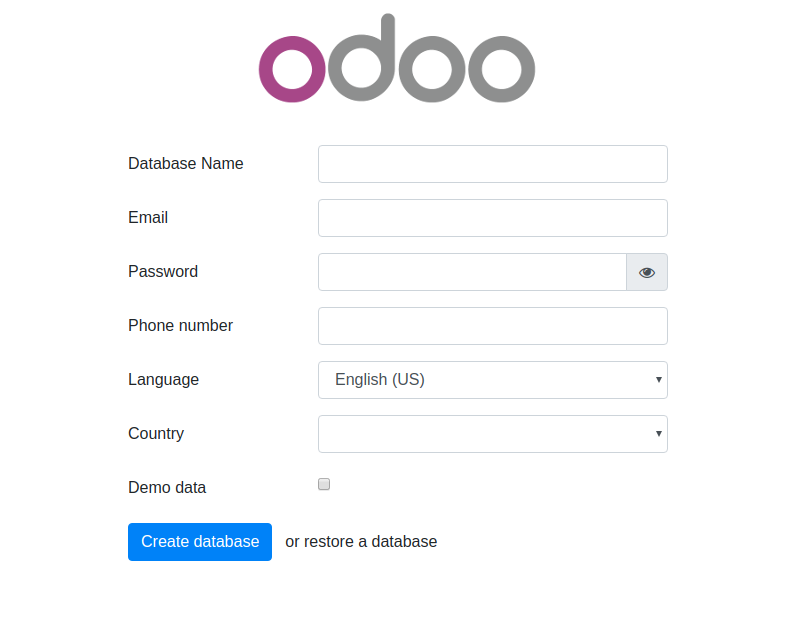
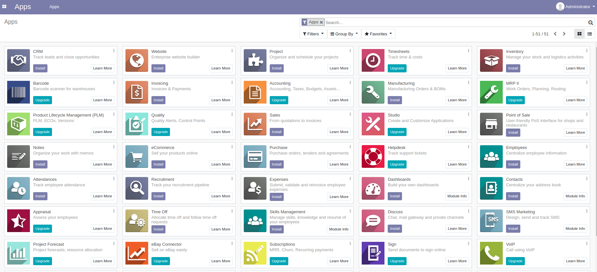
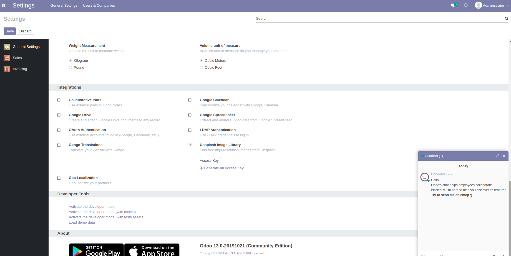

# Usage

Change the folder permission to make sure that the container is able to access the directory:
```
$ sudo chmod -R 777 addons
$ sudo chmod -R 777 etc
```

Start the container:
```
$ docker-compose up
```

* Then open `localhost:9999` to access Odoo 13.0. If you want to start the server with a different port, change **9999** to another value:

```
ports:
 - "9999:8069"
```


* Log file is printed @ **etc/odoo-server.log**

To run in detached mode, execute this command:

```
$ docker-compose up -d
```

# Custom addons

The **addons** folder contains custom addons. Just put your custom addons if you have any.

# Odoo configuration

To change Odoo configuration, edit file: **etc/odoo.conf**.

# docker-compose.yml

* odoo:14
* postgres:13
* pgadmin4

# Odoo 14 screenshots







# Access to PgAdmin:

You can use PgAdmin if you need. It's on port 5080 (127.0.0.1:5080 for example) and default credentials are:

* email: pgadmin
* password: pgadmin

If you don't need PgAdmin, you can comment or delete it in docker-compose.yml.

# Add a new server in PgAdmin:

* Host name/address: db
* Port: 5432
* Username as POSTGRES_USER: odoo
* Password as POSTGRES_PASSWORD: odoo
